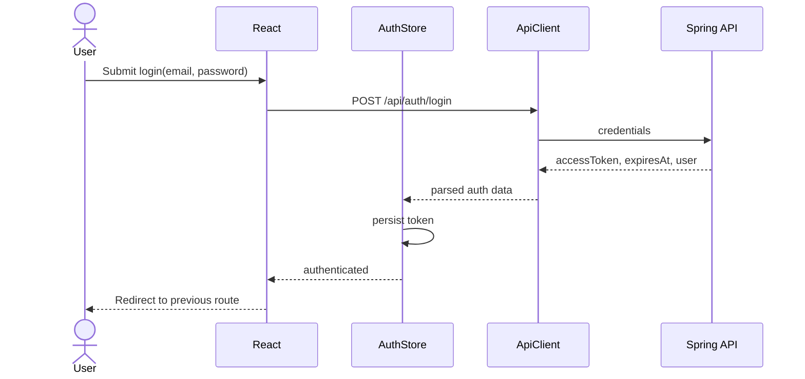
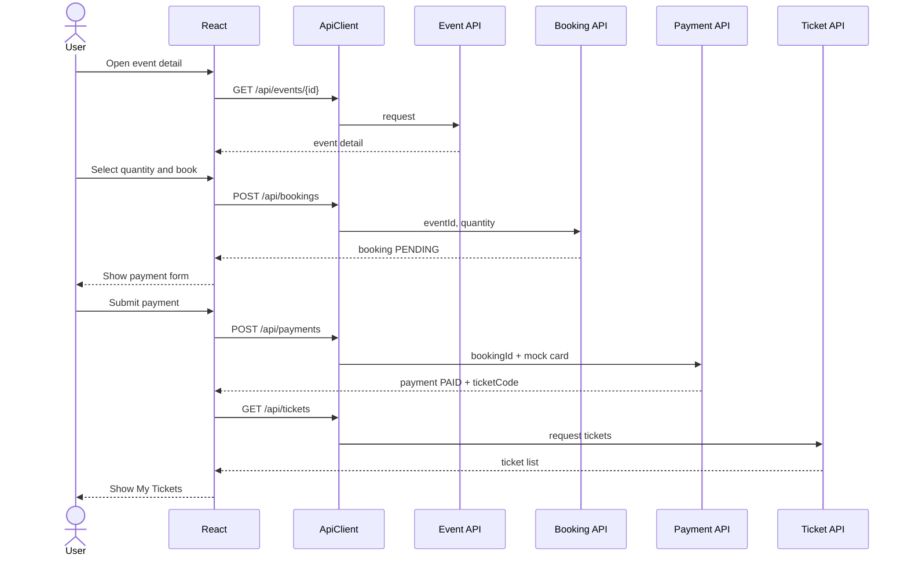
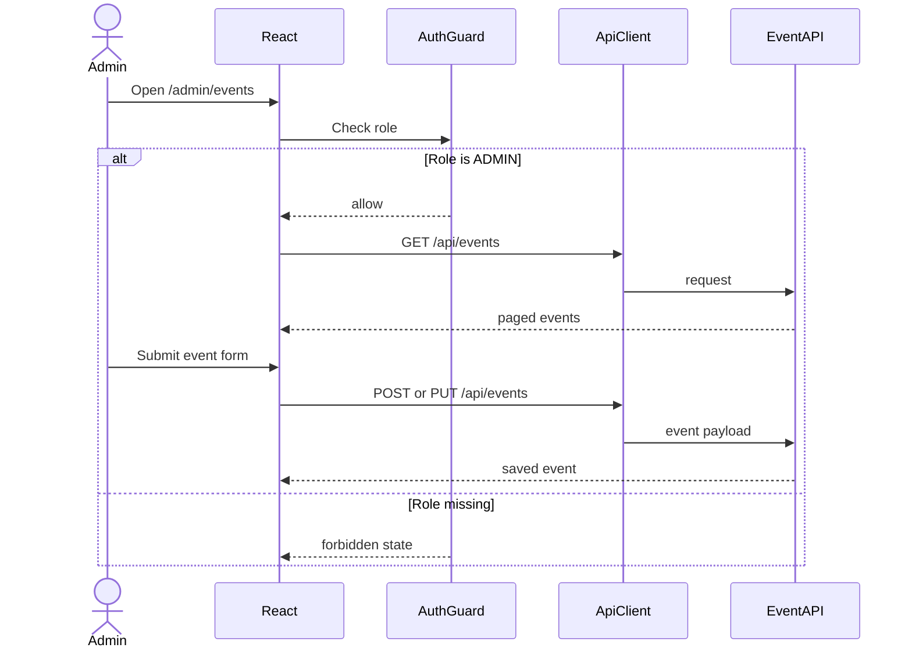
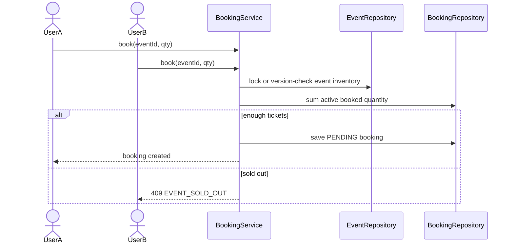

# PRD - Event Booking App

## 1. Business Context và phạm vi sản phẩm

### Problem statement

Người dùng muốn tìm sự kiện phù hợp, kiểm tra thông tin nhanh và mua vé mà không phải trao đổi thủ công qua tin nhắn, chuyển khoản riêng lẻ hoặc chờ xác nhận từ ban tổ chức. Ở phía vận hành, admin cần một nơi tập trung để đăng sự kiện, theo dõi booking và kiểm soát trạng thái vé thay vì quản lý bằng spreadsheet rời rạc.

Event Booking App giải quyết bài toán này bằng một luồng self-service: khám phá sự kiện, đặt vé, thanh toán, nhận vé và quản lý hồ sơ trong cùng một hệ thống.

### Target users và personas

| Persona | Nhu cầu chính | Pain point hiện tại | Tiêu chí thành công |
| --- | --- | --- | --- |
| Guest visitor | Tìm sự kiện công khai, xem giá và địa điểm trước khi đăng nhập. | Thiếu thông tin tập trung, phải hỏi ban tổ chức. | Tìm được sự kiện liên quan trong dưới 2 phút. |
| Registered attendee | Đặt vé, thanh toán và xem lại vé của mình. | Dễ mất mã vé, không rõ booking đã thanh toán hay chưa. | Hoàn tất booking-payment-ticket trong một phiên. |
| Event admin | Tạo, cập nhật, xoá sự kiện và chuẩn bị dữ liệu bán vé. | Quản lý thủ công, khó kiểm tra vé còn lại. | Đăng sự kiện mới trong dưới 5 phút. |
| Future staff/check-in user | Kiểm tra vé tại cổng. | Vé chưa có trạng thái check-in/QR. | Xác thực vé nhanh, tránh dùng lại vé. |

### Product goals

- Cung cấp backend API rõ contract để frontend React tích hợp không bị lệch.
- Hỗ trợ luồng MVP end-to-end: register/login, browse events, booking, payment mock, tickets, profile/reminders và admin event management.
- Thiết kế data model đủ đường mở rộng cho event images, nearby events, ticket tier/seat map, QR check-in và payment gateway thật.
- Giảm rủi ro oversell vé bằng chiến lược locking/inventory trước khi chạy sự kiện có lưu lượng cao.

### Success metrics

| Nhóm KPI | Metric MVP | Mục tiêu ban đầu |
| --- | --- | --- |
| Acquisition | Số user đăng ký mới mỗi tuần | Theo dõi baseline sau khi có frontend |
| Activation | Tỷ lệ registered user tạo booking đầu tiên | >= 25% user đăng ký |
| Conversion | Tỷ lệ event detail -> booking created | >= 10% |
| Payment | Tỷ lệ booking PENDING -> PAID | >= 80% với payment mock, >= 95% payment request hợp lệ |
| Reliability | API error rate không tính lỗi validation/user input | < 1% request |
| Admin efficiency | Thời gian tạo event mới | < 5 phút |
| Engagement | DAU/WAU, số lượt xem event/user | Theo dõi sau khi frontend ra MVP |

### MVP scope

MVP bao gồm:

- Đăng ký, đăng nhập, JWT authentication.
- Xem danh sách và chi tiết sự kiện.
- Admin tạo, sửa, xoá sự kiện.
- Người dùng đặt vé, xem booking, thanh toán mock và xem ticket.
- Cập nhật hồ sơ cá nhân và bật/tắt reminder setting.
- API contract đủ rõ để frontend React triển khai.

Ngoài MVP nhưng đã định hướng:

- Favorite/wishlist events.
- Cancel booking/refund.
- QR ticket check-in.
- Email/push reminder thật.
- Nearby events bằng GPS.
- Ticket tier/seat map.
- Payment gateway thật.

## 2. Quyết định product quan trọng

### Authentication contract

Quyết định: **MVP public contract dùng email-first authentication**.

Frontend và API spec sẽ dùng:

- Register: `fullName`, `email`, `password`.
- Login: `email`, `password`.
- Response auth: `accessToken`, `expiresAt`, `user`.
- `username` không còn là input bắt buộc của frontend. Nếu backend vẫn cần `username` tạm thời, backend có thể map nội bộ từ email hoặc migrate schema/service trong Phase 1.

Lý do:

- Email là định danh tự nhiên cho người dùng cuối.
- Tránh ambiguity giữa API spec, frontend form và backend DTO hiện tại.
- Dễ mở rộng sang forgot password, email verification và social login.

Tác động kỹ thuật:

- Backend hiện tại đang dùng `username/password`; cần migrate DTO, service, repository lookup và tests sang email-first.
- JWT subject nên dùng user id hoặc email ổn định. Với MVP, dùng email là chấp nhận được; production nên cân nhắc user id để tránh ảnh hưởng khi đổi email.

### Response contract

Quyết định: **Success response nên dùng envelope thống nhất** để frontend xử lý đều.

```json
{
  "success": true,
  "message": "Operation successful",
  "data": {}
}
```

Lỗi dùng cùng shape:

```json
{
  "success": false,
  "code": "VALIDATION_ERROR",
  "message": "Validation failed",
  "errors": [
    {
      "field": "email",
      "message": "Invalid email format"
    }
  ]
}
```

Trong Phase 1 có thể giữ DTO trực tiếp nếu cần chạy nhanh, nhưng Phase 2 phải chuẩn hoá envelope trước khi frontend đóng contract.

## 3. Người dùng và vai trò

### Guest

- Xem danh sách sự kiện công khai.
- Xem chi tiết sự kiện.
- Tìm kiếm/lọc sự kiện.
- Đăng ký hoặc đăng nhập.

### Authenticated user

- Xem danh sách và chi tiết sự kiện.
- Tạo booking.
- Thanh toán booking.
- Xem booking/ticket của mình.
- Huỷ booking còn `PENDING`.
- Cập nhật hồ sơ cá nhân.
- Bật/tắt reminder setting.
- Lưu favorite event nếu backend extension được bật.

### Admin

- Tạo, cập nhật, xoá sự kiện.
- Xem dữ liệu event và booking ở các phase mở rộng.
- Không được seed admin mặc định trong production.

## 4. Luồng nghiệp vụ chính

### Register

Người dùng tạo tài khoản bằng full name, email và password. Hệ thống validate email, kiểm tra email unique, kiểm tra password tối thiểu và lưu password bằng BCrypt.

### Login

Người dùng đăng nhập bằng email/password. Hệ thống trả JWT access token, thời điểm hết hạn và thông tin user tối thiểu.

### Browse events

Guest hoặc user xem event list với search, pagination và filter. Filter mục tiêu gồm:

- `popular`: sort theo số booking/ticket sold.
- `upcoming`: sự kiện có thời gian trong tương lai.
- `nearby`: cần `latitude`, `longitude` và vị trí người dùng.

### Event detail

Hiển thị title, date/time, location, price, available tickets, description, image và metadata cần thiết để tạo booking.

### Admin event management

Admin tạo, cập nhật, xoá event. Các endpoint này yêu cầu JWT hợp lệ và role `ADMIN`.

### Booking

User chọn event và quantity. Backend kiểm tra event tồn tại, quantity hợp lệ, vé còn đủ, tính total price và tạo booking trạng thái `PENDING`.

### Payment

User thanh toán một booking của chính mình. MVP dùng payment mock, không lưu raw card data. Booking hợp lệ được chuyển sang `PAID`, tạo payment record và ticket code.

### Tickets and bookings

User xem booking và ticket của mình. Ticket trả về event info, quantity, status và ticket code.

### Profile and reminders

User cập nhật full name, avatar URL và bật/tắt reminder setting.

## 5. API contract chi tiết

### API conventions

- Base path: `/api`.
- Content type: `application/json`.
- Protected endpoints yêu cầu `Authorization: Bearer <accessToken>`.
- Pagination dùng zero-based `page` để phù hợp Spring Data; frontend có thể hiển thị page one-based.
- Timestamp dùng ISO-8601, ví dụ `2026-06-08T19:00:00Z`.
- Money dùng decimal number trong MVP; production nên dùng integer minor unit hoặc `BigDecimal`.

### Common HTTP status

| Status | Khi dùng | Response code |
| --- | --- | --- |
| 200 OK | Read/update/payment thành công | Tuỳ endpoint |
| 201 Created | Tạo user, event, booking thành công | Tuỳ endpoint |
| 204 No Content | Delete thành công | N/A |
| 400 Bad Request | Request đúng schema nhưng vi phạm business rule | `BUSINESS_RULE_VIOLATION` |
| 401 Unauthorized | Thiếu token, token sai, token hết hạn, login sai | `UNAUTHENTICATED` |
| 403 Forbidden | User không có quyền | `FORBIDDEN` |
| 404 Not Found | Resource không tồn tại hoặc không thuộc user hiện tại | `RESOURCE_NOT_FOUND` |
| 409 Conflict | Email đã tồn tại, hết vé, booking đã paid | `EMAIL_ALREADY_EXISTS`, `EVENT_SOLD_OUT`, `BOOKING_ALREADY_PAID` |
| 422 Unprocessable Entity | Validation field-level | `VALIDATION_ERROR` |
| 500 Internal Server Error | Lỗi hệ thống chưa xử lý | `INTERNAL_ERROR` |

### Error code catalog

| Code | Message đề xuất | Ghi chú |
| --- | --- | --- |
| `VALIDATION_ERROR` | Validation failed | Kèm `errors[]`. |
| `EMAIL_ALREADY_EXISTS` | Email already exists | Register conflict. |
| `INVALID_CREDENTIALS` | Invalid email or password | Không tiết lộ email có tồn tại hay không. |
| `UNAUTHENTICATED` | Unauthorized | Token missing/invalid/expired. |
| `FORBIDDEN` | Forbidden | Role không đủ quyền. |
| `RESOURCE_NOT_FOUND` | Resource not found | Dùng cả khi user truy cập resource không thuộc mình. |
| `EVENT_SOLD_OUT` | Not enough tickets available | Nên trả 409. |
| `BOOKING_NOT_PAYABLE` | Booking cannot be paid | Booking cancelled/not owned/not pending. |
| `BOOKING_ALREADY_PAID` | Booking is already paid | Idempotency cần thiết ở phase gateway thật. |
| `BOOKING_NOT_CANCELLABLE` | Only pending bookings can be cancelled | Cancel rule. |
| `PAYMENT_DECLINED` | Payment was declined | Dành cho gateway thật. |
| `RATE_LIMITED` | Too many requests | Khi bật rate limiting. |

### Endpoint detail

#### POST `/api/auth/register`

Request:

```json
{
  "fullName": "Jane Doe",
  "email": "jane@example.com",
  "password": "password123"
}
```

Success `201 Created`:

```json
{
  "success": true,
  "message": "Registered successfully",
  "data": {
    "accessToken": "eyJhbGciOiJIUzI1NiJ9...",
    "expiresAt": "2026-06-09T12:00:00Z",
    "user": {
      "id": 12,
      "fullName": "Jane Doe",
      "email": "jane@example.com",
      "avatar": null,
      "role": "USER"
    }
  }
}
```

Errors: `409 EMAIL_ALREADY_EXISTS`, `422 VALIDATION_ERROR`.

#### POST `/api/auth/login`

Request:

```json
{
  "email": "jane@example.com",
  "password": "password123"
}
```

Success `200 OK`:

```json
{
  "success": true,
  "message": "Logged in successfully",
  "data": {
    "accessToken": "eyJhbGciOiJIUzI1NiJ9...",
    "expiresAt": "2026-06-09T12:00:00Z",
    "user": {
      "id": 12,
      "fullName": "Jane Doe",
      "email": "jane@example.com",
      "avatar": "https://cdn.example.com/avatars/jane.png",
      "role": "USER"
    }
  }
}
```

Errors: `401 INVALID_CREDENTIALS`, `422 VALIDATION_ERROR`.

#### GET `/api/events`

Query params:

| Param | Type | Required | Default | Notes |
| --- | --- | --- | --- | --- |
| `type` | string | No | `upcoming` | `popular`, `upcoming`, `nearby`, `all`. |
| `search` | string | No | null | Search title/location/description. |
| `page` | integer | No | 0 | Zero-based. |
| `size` | integer | No | 10 | Max 100. |
| `sortBy` | string | No | `dateTime` | Whitelist field. |
| `sortDir` | string | No | `asc` | `asc` or `desc`. |
| `latitude` | number | Required if `nearby` | null | User latitude. |
| `longitude` | number | Required if `nearby` | null | User longitude. |

Success `200 OK`:

```json
{
  "success": true,
  "message": "Events retrieved successfully",
  "data": {
    "content": [
      {
        "id": 101,
        "title": "Art Exhibition",
        "dateTime": "2026-07-12T10:00:00Z",
        "location": "Modern Art Gallery, New York",
        "latitude": 40.7128,
        "longitude": -74.006,
        "price": 25.0,
        "description": "Contemporary art showcase",
        "imageUrl": "https://cdn.example.com/events/art.jpg",
        "availableTickets": 80,
        "popularScore": 245
      }
    ],
    "page": 0,
    "size": 10,
    "totalElements": 1,
    "totalPages": 1
  }
}
```

Errors: `422 VALIDATION_ERROR`.

#### GET `/api/events/{id}`

Success `200 OK`:

```json
{
  "success": true,
  "message": "Event retrieved successfully",
  "data": {
    "id": 101,
    "title": "Art Exhibition",
    "dateTime": "2026-07-12T10:00:00Z",
    "location": "Modern Art Gallery, New York",
    "latitude": 40.7128,
    "longitude": -74.006,
    "price": 25.0,
    "description": "Contemporary art showcase",
    "imageUrl": "https://cdn.example.com/events/art.jpg",
    "availableTickets": 80
  }
}
```

Errors: `404 RESOURCE_NOT_FOUND`.

#### POST `/api/events`

Role: `ADMIN`.

Request:

```json
{
  "title": "Art Exhibition",
  "dateTime": "2026-07-12T10:00:00Z",
  "location": "Modern Art Gallery, New York",
  "latitude": 40.7128,
  "longitude": -74.006,
  "price": 25.0,
  "totalTickets": 100,
  "description": "Contemporary art showcase",
  "imageUrl": "https://cdn.example.com/events/art.jpg"
}
```

Success `201 Created`: returns event response.

Errors: `401 UNAUTHENTICATED`, `403 FORBIDDEN`, `422 VALIDATION_ERROR`.

#### PUT `/api/events/{id}`

Role: `ADMIN`.

Request body giống `POST /api/events`.

Success `200 OK`: returns event response.

Errors: `401 UNAUTHENTICATED`, `403 FORBIDDEN`, `404 RESOURCE_NOT_FOUND`, `422 VALIDATION_ERROR`.

#### DELETE `/api/events/{id}`

Role: `ADMIN`.

Success `204 No Content`.

Errors: `401 UNAUTHENTICATED`, `403 FORBIDDEN`, `404 RESOURCE_NOT_FOUND`, `409 BUSINESS_RULE_VIOLATION` nếu event đã có paid booking và policy không cho xoá.

#### POST `/api/bookings`

Role: `USER`.

Request:

```json
{
  "eventId": 101,
  "quantity": 2
}
```

Success `201 Created`:

```json
{
  "success": true,
  "message": "Booking created successfully",
  "data": {
    "bookingId": 501,
    "eventId": 101,
    "eventTitle": "Art Exhibition",
    "quantity": 2,
    "unitPrice": 25.0,
    "totalPrice": 50.0,
    "status": "PENDING",
    "createdAt": "2026-06-08T12:30:00Z"
  }
}
```

Errors: `401 UNAUTHENTICATED`, `404 RESOURCE_NOT_FOUND`, `409 EVENT_SOLD_OUT`, `422 VALIDATION_ERROR`.

#### GET `/api/bookings/my`

Role: `USER`.

Success `200 OK`:

```json
{
  "success": true,
  "message": "Bookings retrieved successfully",
  "data": [
    {
      "bookingId": 501,
      "eventId": 101,
      "eventTitle": "Art Exhibition",
      "quantity": 2,
      "totalPrice": 50.0,
      "status": "PENDING",
      "createdAt": "2026-06-08T12:30:00Z"
    }
  ]
}
```

Errors: `401 UNAUTHENTICATED`.

#### POST `/api/bookings/{id}/cancel`

Role: `USER`.

Success `200 OK`:

```json
{
  "success": true,
  "message": "Booking cancelled successfully",
  "data": {
    "bookingId": 501,
    "status": "CANCELLED"
  }
}
```

Errors: `401 UNAUTHENTICATED`, `404 RESOURCE_NOT_FOUND`, `409 BOOKING_NOT_CANCELLABLE`.

#### POST `/api/payments`

Role: `USER`.

Request:

```json
{
  "bookingId": 501,
  "cardNumber": "4242 4242 4242 4242",
  "expiry": "12/28",
  "cvv": "123",
  "method": "MOCK_CARD"
}
```

Success `200 OK`:

```json
{
  "success": true,
  "message": "Payment completed successfully",
  "data": {
    "paymentId": 9001,
    "bookingId": 501,
    "amount": 50.0,
    "status": "PAID",
    "ticketCode": "TICKET-A1B2C3D4"
  }
}
```

Errors: `401 UNAUTHENTICATED`, `404 RESOURCE_NOT_FOUND`, `409 BOOKING_ALREADY_PAID`, `409 BOOKING_NOT_PAYABLE`, `422 VALIDATION_ERROR`, `402 PAYMENT_DECLINED` khi có gateway thật.

#### GET `/api/tickets`

Role: `USER`.

Success `200 OK`:

```json
{
  "success": true,
  "message": "Tickets retrieved successfully",
  "data": [
    {
      "ticketId": 7001,
      "ticketCode": "TICKET-A1B2C3D4",
      "ticketType": "GENERAL",
      "seatNumber": null,
      "eventId": 101,
      "eventTitle": "Art Exhibition",
      "dateTime": "2026-07-12T10:00:00Z",
      "location": "Modern Art Gallery, New York",
      "quantity": 2,
      "status": "PAID"
    }
  ]
}
```

Errors: `401 UNAUTHENTICATED`.

#### GET `/api/users/profile`

Role: `USER`.

Success `200 OK`:

```json
{
  "success": true,
  "message": "Profile retrieved successfully",
  "data": {
    "id": 12,
    "fullName": "Jane Doe",
    "email": "jane@example.com",
    "avatar": "https://cdn.example.com/avatars/jane.png",
    "role": "USER"
  }
}
```

#### PUT `/api/users/profile`

Role: `USER`.

Request:

```json
{
  "fullName": "Jane Nguyen",
  "avatar": "https://cdn.example.com/avatars/jane-new.png"
}
```

Success `200 OK`: returns profile response.

Errors: `401 UNAUTHENTICATED`, `422 VALIDATION_ERROR`.

#### PUT `/api/users/reminders`

Role: `USER`.

Request:

```json
{
  "eventReminder": true
}
```

Success `200 OK`:

```json
{
  "success": true,
  "message": "Reminder settings updated successfully",
  "data": {
    "eventReminder": true
  }
}
```

Errors: `401 UNAUTHENTICATED`, `422 VALIDATION_ERROR`.

## 6. Data model mục tiêu

### users

| Field | Type | Required | Notes |
| --- | --- | --- | --- |
| `id` | bigint | Yes | Primary key. |
| `full_name` | varchar | Yes | Display name. |
| `email` | varchar unique | Yes | Login identifier. |
| `password_hash` | varchar | Yes | BCrypt. |
| `avatar` | varchar | No | URL in MVP. |
| `role` | varchar | Yes | `USER`, `ADMIN`; current code may use roles table. |
| `created_at` | timestamp | Yes | Audit. |
| `updated_at` | timestamp | Yes | Audit. |

### events

| Field | Type | Required | Phase | Notes |
| --- | --- | --- | --- | --- |
| `id` | bigint | Yes | MVP | Primary key. |
| `title` | varchar | Yes | MVP | Event title. |
| `date_time` | timestamp | Yes | MVP | Event start time. |
| `location` | varchar | Yes | MVP | Display location. |
| `latitude` | decimal | No | Phase 2 | Required for nearby events. |
| `longitude` | decimal | No | Phase 2 | Required for nearby events. |
| `price` | decimal | Yes | MVP | Ticket unit price. |
| `total_tickets` | integer | Yes | MVP | Inventory ceiling. |
| `description` | text | No | MVP | Event description. |
| `image_url` | varchar | No | Phase 2 | Needed by frontend event card/detail. |
| `created_at` | timestamp | Yes | Phase 2 | Audit. |
| `updated_at` | timestamp | Yes | Phase 2 | Audit. |
| `version` | integer | No | Phase 1 hardening | Optimistic locking for inventory updates. |

### bookings

| Field | Type | Required | Notes |
| --- | --- | --- | --- |
| `id` | bigint | Yes | Primary key. |
| `user_id` | bigint | Yes | Owner. |
| `event_id` | bigint | Yes | Event. |
| `quantity` | integer | Yes | Must be >= 1. |
| `unit_price` | decimal | Yes | Snapshot price. |
| `total_price` | decimal | Yes | Snapshot total. |
| `status` | varchar | Yes | `PENDING`, `PAID`, `CANCELLED`, future `REFUNDED`. |
| `created_at` | timestamp | Yes | Booking time. |
| `updated_at` | timestamp | Yes | Status changes. |

### payments

| Field | Type | Required | Notes |
| --- | --- | --- | --- |
| `id` | bigint | Yes | Primary key. |
| `booking_id` | bigint | Yes | One payment per successful booking in MVP. |
| `amount` | decimal | Yes | Payment amount. |
| `method` | varchar | Yes | `MOCK_CARD`, future gateway method. |
| `status` | varchar | Yes | `PAID`, `FAILED`, future `REFUNDED`. |
| `provider_reference` | varchar | No | Gateway transaction id. |
| `created_at` | timestamp | Yes | Payment time. |

### tickets

| Field | Type | Required | Phase | Notes |
| --- | --- | --- | --- | --- |
| `id` | bigint | Yes | MVP | Primary key. |
| `ticket_code` | varchar unique | Yes | MVP | Human-readable code. |
| `booking_id` | bigint | Yes | MVP | Source booking. |
| `ticket_type` | varchar | No | Phase 4 | `GENERAL`, `VIP`, `EARLY_BIRD`. Default `GENERAL`. |
| `seat_number` | varchar | No | Phase 4 | Nullable until seat map exists. |
| `qr_payload` | text | No | Phase 4 | For QR check-in. |
| `check_in_status` | varchar | No | Phase 4 | `UNUSED`, `CHECKED_IN`, `REVOKED`. |
| `created_at` | timestamp | Yes | Phase 2 | Audit. |

### reminders

| Field | Type | Required | Notes |
| --- | --- | --- | --- |
| `id` | bigint | Yes | Primary key. |
| `user_id` | bigint | Yes | One reminder setting per user. |
| `event_reminder` | boolean | Yes | Enable/disable. |
| `created_at` | timestamp | Yes | Audit. |
| `updated_at` | timestamp | Yes | Audit. |

## 7. Frontend React specification

### Stack

- React + Vite.
- React Router.
- Axios or Fetch wrapper.
- Zustand hoặc Context API cho auth state.
- React Hook Form cho form state/validation.
- Tailwind CSS, CSS Modules hoặc SCSS.
- LocalStorage cho MVP token storage; production nên cân nhắc HttpOnly cookie nếu có backend support.

### Routes

| Route | Access | Screen |
| --- | --- | --- |
| `/` | Public | Event listing. |
| `/events/:id` | Public | Event detail. |
| `/login` | Public only | Login. |
| `/register` | Public only | Register. |
| `/bookings/checkout/:eventId` | User | Booking confirmation. |
| `/payments/:bookingId` | User | Payment. |
| `/tickets` | User | My tickets/bookings. |
| `/profile` | User | Profile and reminder settings. |
| `/admin/events` | Admin | Event management. |
| `/admin/events/new` | Admin | Create event. |
| `/admin/events/:id/edit` | Admin | Edit event. |

### Component breakdown

| Component | Responsibility | Depends on |
| --- | --- | --- |
| `AppShell` | Main layout, nav, auth-aware links. | `useAuthStore`. |
| `AuthGuard` | Protect user/admin routes. | Auth state and role. |
| `ApiClient` | Attach token, parse envelope, handle 401/403. | Token storage. |
| `EventListPage` | Search/filter/pagination and event grid/list. | `EventCard`, event API. |
| `EventCard` | Show title, date, location, price, image, available tickets. | Event response. |
| `EventDetailPage` | Detail content and booking CTA. | Event API, auth state. |
| `BookingPanel` | Quantity selector, price summary, create booking. | Booking API. |
| `PaymentPage` | Mock card form, pay booking, success transition. | Payment API. |
| `TicketsPage` | List tickets/bookings and status badges. | Tickets/bookings API. |
| `ProfileSettingsPage` | Full name/avatar/reminder form. | User API. |
| `AdminEventListPage` | Admin event table, edit/delete actions. | Admin event API. |
| `EventForm` | Create/update event form. | Validation schema. |
| `StateView` | Reusable loading/empty/error/forbidden states. | UI system. |

### UI states

Every data screen must define:

- Loading: skeleton rows/cards while API request is pending.
- Empty: event list has no results, ticket list has no tickets, admin list has no events.
- Error: network/server error with retry action.
- Validation: field-level messages from `errors[]`.
- Unauthorized: clear token and redirect to `/login`.
- Forbidden: show access denied state, keep user logged in.
- Success: toast/inline confirmation for create/update/payment/profile save.

### Auth state flow

1. App startup reads token from storage.
2. If token exists, app marks auth as `checking` and calls `GET /api/users/profile`.
3. If profile succeeds, store `user`, `role`, `isAuthenticated=true`.
4. If profile returns 401, clear token and redirect protected route to login.
5. Login/register success writes token and user to store, then redirects to previous route or `/`.
6. Axios/fetch interceptor attaches `Authorization` for protected calls.
7. 403 does not logout; UI shows forbidden state.
8. Logout clears token and user, then redirects to `/login`.

### Text wireframes

Event listing:

```text
[Top nav: logo | Events | Tickets | Profile | Admin/Login]
[Search input] [Type segmented control: Upcoming | Popular | Nearby] [Sort]
[Event card image] Title
Date/time - Location
Price - Available tickets
[View details]
[Pagination]
```

Event detail:

```text
[Image]
Title
Date/time - Location - Price
Description
[Quantity stepper] [Total price]
[Book now]
```

Payment:

```text
Booking summary
Card number / Expiry / CVV
[Pay]
Success state -> [View my tickets]
```

Admin event management:

```text
[Create event]
Table: title | date | location | price | available | actions
Actions: edit, delete
```

## 8. Sequence diagrams

### React auth sequence



### React booking and payment sequence



### React admin event sequence



### Backend inventory protection sequence



## 9. Non-functional requirements

### Performance

- Event list/detail p95 response time: < 500 ms for MVP data volume.
- Booking/payment p95 response time: < 700 ms excluding external payment gateway latency.
- API should support at least 100 concurrent authenticated users and 500 concurrent anonymous browse requests in MVP test environment.
- Pagination required for event list, admin list, bookings and tickets.

### Reliability and consistency

- Booking creation must be transactional.
- Oversell prevention is required before public launch: use pessimistic lock on event inventory, optimistic locking with `version`, or a dedicated inventory/reservation table.
- Payment should be idempotent by `bookingId` for MVP mock and by idempotency key when gateway is integrated.

### Security

- JWT expiration: 24 hours in local/dev, 1-2 hours in production unless refresh token flow is added.
- Passwords must be BCrypt hashed.
- CORS must whitelist explicit frontend origins; do not use wildcard in production.
- Rate limiting targets:
  - Auth endpoints: 5 failed attempts/minute/email/IP.
  - Booking/payment endpoints: conservative per-user limit to reduce abuse.
- Secrets such as DB password and JWT secret must come from environment variables or secret manager, not committed properties files.
- Do not persist raw card number, expiry or CVV. Payment mock may validate format only.
- Admin seed must be disabled by default and guarded by `spring.profiles.active=dev,test` plus `app.admin.seed=true`; app should refuse seed when active profile is `prod`.

### Deployment environments

- Local: Spring Boot + MySQL local, H2 for tests, React dev server.
- Test/CI: H2 or test container DB, deterministic seed data.
- Staging: MySQL/PostgreSQL managed DB, CORS to staging frontend, production-like secrets.
- Production: HTTPS, managed DB, secret manager, monitoring/log aggregation, no admin seed.

### Observability

- Log auth failures without password/card data.
- Log booking/payment status transitions with booking id and user id.
- Track metrics for request count, latency, error rate, booking conversion and payment success.

## 10. Hiện trạng codebase backend

Codebase hiện tại là Spring Boot backend với Maven, Spring Web, Spring Security, Spring Data JPA, JWT, Validation, Lombok, MySQL runtime và H2 test.

### Implemented in code snapshot

| Area | Trạng thái | Ghi chú |
| --- | --- | --- |
| Auth/JWT | Partial | Có register/login JWT nhưng contract hiện dùng `username`, cần migrate email-first. |
| Event API | Partial | Có list/detail/admin CRUD; cần thêm `type=popular/nearby`, `imageUrl`, `latitude`, `longitude`. |
| Booking | Partial | Có create booking, status, total price, cancel pending; cần locking chống oversell. |
| Payment | Partial | Mock payment tạo payment/ticket; cần response envelope, validation và idempotency. |
| Tickets | Partial | Có list tickets; cần `ticketType`, `seatNumber` ở phase sau. |
| Profile/reminders | Partial | Có endpoints cơ bản; cần validation/envelope. |
| Favorites | Extension partial | Backend tối thiểu đã có trong code snapshot. |
| Frontend | Not started | Chưa có React source trong repo. |

### Gaps cần xử lý

- Auth contract hiện lệch: code dùng `username`, PRD quyết định email-first.
- Success response chưa thống nhất envelope.
- Error code/status cần chuẩn hoá theo catalog ở Section 5.
- Event model thiếu `imageUrl`, `latitude`, `longitude`, audit fields và locking/version.
- Popular/nearby filters chưa đủ theo product goal.
- Admin seed cần guard bằng profile dev/test.
- Main config không nên chứa secret local hard-coded.
- Build/test phụ thuộc JDK target; môi trường dev cần thống nhất JDK theo `pom.xml`.

## 11. Risk management

| Risk | Severity | Impact | Mitigation |
| --- | --- | --- | --- |
| Auth username/email ambiguity | High | Frontend/backend tích hợp sai contract. | Đã chốt email-first trong PRD; Phase 1 migrate backend DTO/service/tests. |
| Race condition khi nhiều user đặt cùng event hot | High | Oversell, mất uy tín, khó refund. | Thêm pessimistic/optimistic locking hoặc inventory table trước public launch; test concurrent booking. |
| Admin seed bật nhầm production | High | Tạo tài khoản admin mặc định ngoài môi trường an toàn. | `app.admin.seed=false` mặc định, chỉ cho `dev/test`, app fail-fast nếu seed true trên `prod`. |
| Payment mock bị hiểu nhầm là payment thật | Medium | Sai kỳ vọng nghiệp vụ và bảo mật card. | Gắn nhãn mock rõ ràng, không lưu raw card, phase gateway riêng. |
| Response shape không thống nhất | Medium | Frontend phải xử lý nhiều kiểu response. | Chuẩn hoá envelope/error catalog trước khi frontend bắt đầu. |
| Frontend chưa triển khai | Medium | Chưa demo được user journey end-to-end. | Scaffold React sau khi API contract ổn định. |
| Hard-coded local secrets | Medium | Rủi ro lộ credential và khó deploy. | Dùng env vars, profile-specific config, không commit secret thật. |

## 12. Roadmap ưu tiên

### Phase 1 - Ngay

- Migrate auth sang email-first contract.
- Chuẩn hoá response envelope và error catalog.
- Thêm request/response tests cho các API chính.
- Guard admin seed bằng profile dev/test.
- Loại bỏ secret hard-coded khỏi main config.
- Thêm locking hoặc version field để chống oversell booking.

### Phase 2 - Đồng bộ API/data model

- Thêm `imageUrl`, `latitude`, `longitude`, `createdAt`, `updatedAt` cho events.
- Thêm popular/nearby filters.
- Thêm status/error code đầy đủ cho booking/payment.
- Bổ sung ticket fields nullable: `ticketType`, `seatNumber`.
- Chuẩn hoá Swagger/OpenAPI hoặc API docs từ contract này.

### Phase 3 - React MVP

- Scaffold React + Vite.
- Tạo API client, auth store, route guards.
- Tạo event listing/detail với loading/empty/error states.
- Tạo booking/payment/tickets/profile flows.
- Tạo admin event management.

### Phase 4 - Product extensions

- Favorite UI.
- QR ticket check-in.
- Email/push reminders.
- Refund/cancel paid booking.
- Admin analytics.
- Upload event/avatar images.
- Payment gateway sandbox.

## 13. Acceptance criteria

PRD được xem là đủ dùng cho triển khai tiếp khi:

- Có problem statement, target personas và success metrics.
- Có quyết định auth email-first rõ ràng.
- Có API contract với request/response mẫu, status codes và error codes.
- Có frontend routes, component breakdown, UI states và auth state flow.
- Có NFR cho performance, concurrency, security, deploy environments.
- Có data model fields và phase bổ sung cho event image/GPS, ticket type/seat.
- Có sequence diagram từ góc độ React tới API.
- Có risk severity đúng cho race condition và admin seed.
